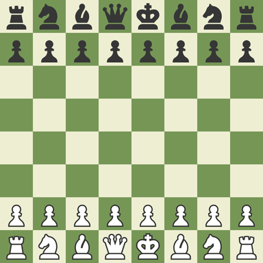

# Binary Chess

This is the story of how I made Chess using bitboards. (Maybe I'll have an engine, who knows? :eyes:)

## Note: This repository features C# and Python files jumbled together. This will be fixed eventually.

## Board Representation

In case you don't know, this is what a chess board looks like:



There are commonly 3 ways a game of chess is programmed. I'll go briefly into the pros and cons of all three methods below.

### 1. Using a 2D array

Well, when you think of a chess board, it's 8 squares along and 8 squares down, so it makes sense to construct a board like this, right?

```yml
[
    [ r n b q k b n r ],
    [ p p p p p p p p ],
    [ . . . . . . . . ],
    [ . . . . . . . . ],
    [ . . . . . . . . ],
    [ . . . . . . . . ],
    [ P P P P P P P P ],
    [ R N B Q K B N R ]
                ^
               here
]
```

Say you wanted the square where the king's bishop starts. That can easily be represented by the index: `[7][5]`.

However, accessing multiple arrays and especially copying nested arrays (in the event of constructing a decision tree) is very time-consuming and inefficient.

| Pros      | Cons |
|:-:|:-:|
| Intuitive | Slow, since you need to access two arrays |
| Easy to update | Positions are two numbers instead of one |

### 2. Using a 1D array

This is a bit better than the 2D array approach, now that you reduce the overhead of accessing two arrays, but it can still be improved.

For a start, when calculating things like rook and bishop moves, you can unintentionally go to the other side of the board when checking squares. On the 2D array, you can easily check that `x` and `y` (in `[x][y]` format) don't exceed either 0 or 7:

```py
def check(x: int, y: int) -> bool:
    return 0 <= x < 8 and 0 <= y < 8
```

But for a 1D array, you have to either:
- manually get an `x` and `y` value (using `divmod(n, 8)`) and check that way
- store an array of edge values (like a mask) so you know when to stop

Either way, we can still do better.

### 3. Using bitboards [the best approach]

A chess board has 64 squares. Most computers can do incredibly fast and optimised operations on 64-bit numbers. Can you see a correlation?

We can use what's called a bitboard to represent our game state. A bitboard is just a binary number that represents some position (or part of a position) of a game. For example, in Connect Four, you can represent this position:
```yml
. . . . . . .
. . . . . . .
. . . . . . .
. . . 2 . . .
. . 1 1 . . .
. . 2 1 . . .
```

With two binary numbers to represent the counters of each player:
```yml
# Player 1          # Player 2
. . . . . . .       . . . . . . .
. . . . . . .       . . . . . . .
. . . . . . .       . . . . . . .
. . . . . . .       . . . 1 . . .
. . 1 1 . . .       . . . . . . .
. . . 1 . . .       . . 1 . . . .
```

We can do the same with chess. Take this position for example:


A bitboard representing all the pieces on the board could look like this:
```yml
. . . . . . . .
. . 1 . . . . 1
. 1 . 1 . . . 1
. . 1 1 . . 1 .
1 . . . . . . 1
. . 1 1 1 1 . .
. . . . 1 . 1 .
. . . 1 . . . .
```

For context, I'm using what's known as a Little Endian format for my bitboards. The positions of each bit are laid out like this:
```yml
56 57 58 59 60 61 62 63
48 49 50 51 52 53 54 55
40 41 42 43 44 45 46 47
32 33 34 35 36 37 38 39
24 25 26 27 28 29 30 31
16 17 18 19 20 21 22 23
 8  9 10 11 12 13 14 15
 0  1  2  3  4  5  6  7
```


## Move Generation

The first and most important step of the game of chess is moving pieces. How else would you be able to even play a game of chess if not for being able to move pieces?

I'm sure you know about chess (why else would you be reading this?) and the rules on the board. Rules like:

- do not lob the board with its pieces at your opponent (at any time).
- pawns may not be flicked across the board at your opponent's eyes.
- taking the opponent's queen off the board and blowing a rasperry at them is not permitted.

Apologies. Wrong rule list. Just found the right one now:

- you cannot castle into check.
- bishops cannot move orthogonally.
- pawns cannot promote to a king.

Well, consider all the six different types of pieces in the game of Chess:

- pawns
- knights
- bishops
- rooks
- queens
- kings

We can categorise them into two types: static and sliding. Static pieces have fixed reach limits that will always remain the same, no matter the position. Pawns cannot move backwards, kings cannot move off of the board - you get the idea. However, sliding pieces can move in any number of squares along the board, and but their moves are halted if "blockers" are in the way. In short, static pieces have moves that are _not_ determined by the state of the board, whereas sliding pieces have moves that _are_ affected by the current state of the board.

** [ To be continued... ] **