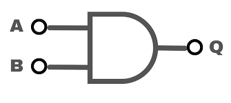
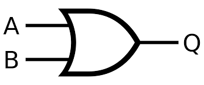

# Chess using Bitboards

This is an explanation of the concept of using bitboards in chess, which is useful if you want to construct an AI to play the game. This tutorial will use Python, as much of the whole repository is completely Python, and will demonstrate how you can perform bitboard magic to make your games more fluent.

This was heavily inspired by denkspuren's [Connect 4 Bitboard Design](https://github.com/denkspuren/BitboardC4/blob/master/BitboardDesign.md), which you can find there, and big thanks to him as I referred back to this a lot for my project. It goes through all the steps you need to:

- understand **why** you use bitboards
- understand **how** you use bitboards
- understand how to construct your own bitboard
- understand the importance of "magic numbers"

This is also good for learning what the various bitwise operations do, as well as how to combine them to get a desired outcome.

## Bitwise Operations

Computers work using binary which is how numbers are represented in the internals of a computer. Binary can be used to represent a lot of numbers with only a few bits.

# of bits | # of representable numbers
--------- | --------------------------
1 bit     | 2
2 bits    | 4
3 bits    | 8
4 bits    | 16
5 bits    | 32
6 bits    | 64
...

If you think of the number of bits as `b` then you can represent `2^b` numbers with `b` bits.  On these bits, computers can perform various operations using logic gates. The two most important ones are the `AND` gate and the `OR` gate.

### AND Gates

The `AND` gate only outputs a `1` (turns on) when _both_ of its inputs are `1` (both are turned on). This means if, say you have two lamps and both of those lamps are on, then my lamp will turn on.



### AND Gate Truth Table

Input A | Input B | Output Q
------- | ------- | --------
0       | 0       | 0
0       | 1       | 0
1       | 0       | 0
1       | 1       | 1


### Demonstration

In Python, this operation is performed with the `&` symbol.

```py
# Example
print(12 & 8)
```

The `AND` gate truth table is performed across all the bits of a binary in binary, so what the calculation `12 & 8` looks like is this:

```py
    0b1100 # 12 in binary
  & 0b0100 # 8 in binary
  --------
    0b0100
```

As you can see, only the second bit in the number (from the left) is in both numbers, so since that bit is "on" in both

And on longer numbers, the AND gate truth table becomes more apparent.
```py
# AND gate demonstration
    0b1011001111101100010000111101000
  & 0b0010111101100001000011011011011
--------------------------------------
    0b0010001101100000000000011001000
```

### OR Gates

The `OR` gate only outputs a `1` if _either_ of its inputs are `1`, so if your first lamp **or** your second lamp are on, then my lamp will turn on.



### OR Gate Truth Table

Input A | Input B | Output Q
------- | ------- | --------
0       | 0       | 0
0       | 1       | 1
1       | 0       | 1
1       | 1       | 1


### Demonstration

In Python, this operation is performed with the `|` symbol.

```py
# Example
print(12 | 8)
```

Much like the `AND` gate demonstration I showed before, the `OR` gate truth table is performed on every bit.

```py
    0b1100 # 12 in binary
  & 0b0100 # 8 in binary
-----------
    0b1100 # 12 in binary
```

And again, much like the `OR` gate, the truth table becomes more apparent when seen on longer numbers.

```py
# OR gate demonstration
    0b1011001111101100010000111101000
  | 0b0010111101100001000011011011011
--------------------------------------
    0b1011111111101101010011111111011
```

### Why use bitwise operations?

Bitwise operations are important for something called **bitboards**, which are a way of representing game boards that let the computer understand the position on the board. For Connect 4 and other similar board games, bitboards let an AI play hundreds of thousands of moves to calculate tens of turns ahead incredibly quickly, as instead of accessing and modifying memory like it would have to using 2-dimensional arrays, it can simply perform a bitwise operation to get the exact same result in far less time. This reduction in time is important because computers have to crunch through (for Connect 4) hundreds of thousands of positions, or even (for chess) millions of positions, to find an optimum route with perfect play.

## How to make a bitboard for Chess

The premise is simple. For this tutorial, we will use piece-centric bitboards instead of board-centric. This means every piece on the board will have its own bitboard, as opposed to a giant bitboard with all representative pieces on it.

## The Humble Beginnings

We can have two classes for grouping both side's pieces so we don't have to manage a bunch of stray variables. The class structure for white is shown below.

```py
class White:
    """
    Binary representation of each of the white pieces.

    Board at start:
    . . . . . . . .
    . . . . . . . .
    . . . . . . . .
    . . . . . . . .
    . . . . . . . .
    P P P P P P P P
    R N B Q K B N R
    """

    bishops = 0b00000000_00000000_00000000_00000000_00000000_00000000_00000000_00100100
    knights = 0b00000000_00000000_00000000_00000000_00000000_00000000_00000000_01000010
    rooks = 0b00000000_00000000_00000000_00000000_00000000_00000000_00000000_10000001
    king = 0b00000000_00000000_00000000_00000000_00000000_00000000_00000000_00001000
    queen = 0b00000000_00000000_00000000_00000000_00000000_00000000_00000000_00010000

    @classmethod
    def mask(cls):
        "Returns a board mask of all of white's pieces on the board."
        return cls.bishops | cls.knights | cls.rooks | cls.king | cls.queen
```

For white, we will list the bitboards of the pieces as binary, and then define a class method so we can use the class itself which is universal across the file, instead of managing and tracking instances of the class, which could cause confusion later.

Again, we can make a similar class for black's pieces.

```py
class Black:
    """
    Binary representation of each of the white pieces.

    Board at start:
    r n b q k b n r
    p p p p p p p p
    . . . . . . . .
    . . . . . . . .
    . . . . . . . .
    . . . . . . . .
    . . . . . . . .
    """

    bishops = 0b00100100_00000000_00000000_00000000_00000000_00000000_00000000_00000000
    knights = 0b01000010_00000000_00000000_00000000_00000000_00000000_00000000_00000000
    rooks = 0b10000001_00000000_00000000_00000000_00000000_00000000_00000000_00000000
    king = 0b00001000_00000000_00000000_00000000_00000000_00000000_00000000_00000000
    queen = 0b00010000_00000000_00000000_00000000_00000000_00000000_00000000_00000000

    @classmethod
    def mask(cls):
        "Returns a board mask of all of black's pieces on the board."
        return cls.bishops | cls.knights | cls.rooks | cls.king | cls.queen
```

### Testing Purposes

We'll also include a display board which I call `RegularBoard` since it displays a top-down view of a regular board with one or two pieces on. This is useful for debugging and viewing certain positions.

```py
from dataclasses import dataclass

@dataclass
class RegularBoard:
    board: Binary

    def __repr__(self) -> str:
        board = ''

        for n in range(64):
            # add a 1 if there is a 1 in the bitboard, else add a dot
            board += '1 ' if (1 << n) & self.board else '. '
            # if 8 squares have been mapped, go to a new line
            board += '\n' if not (n + 1) % 8 else ''

        return board
```

This produces a board from a numerical input with the bits ordered as shown below.

```yaml
 0  1  2  3  4  5  6  7
 8  9 10 11 12 13 14 15
16 17 18 19 20 21 22 23
24 25 26 27 28 29 30 31
32 33 34 35 36 37 38 39
40 41 42 43 44 45 46 47
48 49 50 51 52 53 54 55
56 57 58 59 60 61 62 63
```

If we print a `RegularBoard` instance, given the board argument is `0`, we get:

```yaml
. . . . . . . .
. . . . . . . .
. . . . . . . .
. . . . . . . .
. . . . . . . .
. . . . . . . .
. . . . . . . .
. . . . . . . .
```

### How does the \_\_repr\_\_ work?

How the `__repr__` section of `RegularBoard` works is by pretty much just incrementing a position on the board and checking if it has found a piece on the board using `AND` gate logic (explained earlier) and checking for a non-zero answer.

Also, after a line is converted, a newline character is added.

This "position" is just a 1 repeatedly shifted, but to each position on the board. For example, here is a 1 shifted 39 bits to the left (forward on the board) and a 1 shifted 12 bits to the left.

```yaml
1 << 39           |   1 << 12
. . . . . . . .   |   . . . . . . . .
. . . . . . . .   |   . . . . 1 . . .
. . . . . . . .   |   . . . . . . . .
. . . . . . . .   |   . . . . . . . .
. . . . . . . 1   |   . . . . . . . .
. . . . . . . .   |   . . . . . . . .
. . . . . . . .   |   . . . . . . . .
. . . . . . . .   |   . . . . . . . .
```

As you can see, the 1 lands exactly where the bit shift amount is listed on the diagram I showed earlier.

## Adding movement

